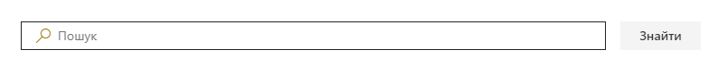
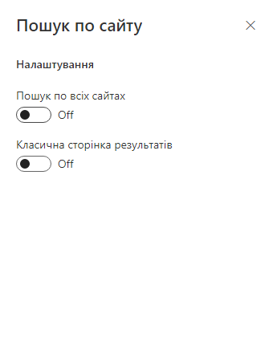

# SPFx React Search Box webpart #

## Опис

Проста веб-частина зі строкою пошуку на SharePoint Framework та React.

### Особливість

Можливість налаштування з вибором сторінки результатів (Modern/Classic) та маштабом пошуку.

## Quick start

- Clone this repository.
- Open the command line, navigate to the web part folder and execute:
    - `npm i`
    - `gulp test` (optional)
    - `gulp serve --nobrowser`
- Navigate to the hosted version of the SharePoint workbench (`https://<your_tenant>.sharepoint.com/sites/<your_site>/_layouts/15/workbench.aspx`).
- Add the **SPFx React Search Box** web part.